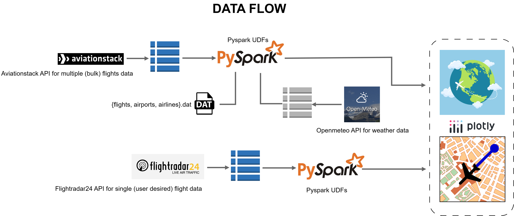

# FlightRisk: Real-time Flight Weather Risk Assessment Tool

**Enhancing Aviation Safety through Real-time Weather Visualization and Predictive Risk Analysis**

## Overview

FlightRisk is a comprehensive flight tracking and risk assessment tool designed to improve aviation safety by providing real-time weather visualization and identifying potential weather-related risks along flight routes. By leveraging historical weather data, current meteorological conditions, and flight path information, FlightRisk empowers pilots, dispatchers, and aviation professionals to make informed decisions and mitigate weather-related hazards.

## Problem Statement

Weather conditions are a significant factor in aviation safety.  Unexpected turbulence, severe storms, icing conditions, and reduced visibility can pose serious risks to flights.  Accurate, real-time weather information and predictive risk assessments are crucial for preventing accidents and ensuring passenger safety.

## Solution

FlightRisk addresses this problem by providing a user-friendly interface that displays real-time weather data overlaid on flight routes.  The system analyzes weather patterns, forecasts, and historical data to identify potential hazards and generate risk assessments for specific flight paths. This enables proactive decision-making and allows for route adjustments to avoid hazardous weather conditions.

## Key Features

*   **Real-time Weather Visualization:**  Interactive maps displaying current weather conditions, including temperature, wind speed, precipitation, and visibility.
*   **Flight Tracking:**  Real-time tracking of flight positions and routes.
*   **Risk Assessment:**  Automated risk assessment based on weather conditions along the flight path, highlighting potential hazards.
*   **Historical Weather Data Analysis:**  Analysis of historical weather patterns to identify trends and predict future risks.
*   **Customizable Alerts:**  Configurable alerts for specific weather conditions or risk levels.
*   **User-Friendly Interface:**  Intuitive and easy-to-use interface for accessing weather data and risk assessments.

## Technical Details

*   **Data Sources:**
    *   Real-time weather data from `Open-Meteo`
    *   Flight data from `FlightRadar24API`
    *   Historical weather data from `Open-Meteo`
*   **Technologies:**
    *   Programming Languages: `Python`
    *   Frontend: `Plotly`
    *   Backend: `Python`
    *   Mapping Library: `Plotly`
*   **Architecture:**  


## Setup and Installation

1.  **Clone the repository:**

    ```
    git clone https://github.com/benahalkar/Flight-data-analytics.git
    cd Flight-data-analytics
    ```

2.  **Install dependencies:**

    ```
    pip install -r requirements.txt  # Or equivalent for your environment
    ```

3.  **Configure API keys:**

    *   Obtain API keys from `Open-Meteo` and `FlightRadar24API`.
    *   Set the API keys as environment variables:

        ```
        export WEATHER_API_KEY="your_weather_api_key"
        export FLIGHT_API_KEY="your_flight_api_key"
        ```


## Usage

1.  **Run the application:**

    ```
    python flight_tracker_application.py 
    ```

2.  **Access the application in your browser:**

    *   Open your web browser and navigate to `http://localhost:8050`.

## Contributing

We welcome contributions to FlightRisk!  To contribute:

1.  Fork the repository.
2.  Create a new branch for your feature or bug fix.
3.  Make your changes and commit them with clear, descriptive messages.
4.  Submit a pull request.

## License

This project is licensed under the MIT License - see the [LICENSE](./LICENSE) file for details.

## Contact

For questions or inquiries, please contact Harsh at hb2776@columbia.edu.
